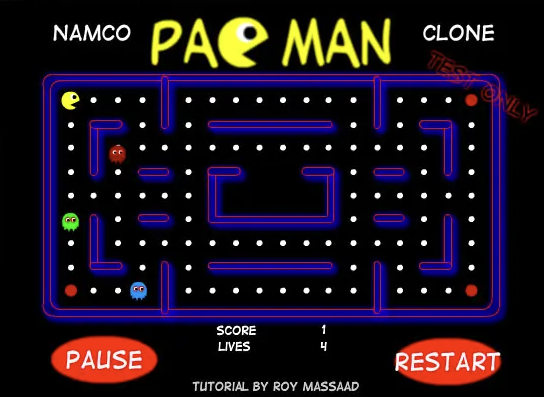

# pacman-flash-game
Pacman Clone Flash CS6 game

Code : Roy Massaad

Date : Circa 2008

License : MIT

**Description:**

This is a Pacman game clone i wrote in Adobe Flash CS6

I created it as part of coding tutorial on a gaming blog i ran named GameBuzz

The file format is .FLA, it uses the Timeline and Actionscript 3

I tested it before uploading it now, it still runs

